<!--
  ✦ Hirun Chamara — GitHub profile README
  The animated hero lives in assets/hero-card.svg — edit the name/tagline there.
-->

  

  
  
  
  
  
  &nbsp;
  

<h3 align="center">🛰️ Software Engineering @ Birmingham City University &nbsp;·&nbsp; 🌌 Building across web, web3 &amp; robotics</h3>

---

## 👨‍🚀 whoami

Hey, I'm **Hirun** 👋 — a Software Engineering student who treats every project like a small expedition. By day I ship **full-stack web apps**; by night I'm deep in **web3 smart contracts**, wiring up **robotics**, or looking up at the actual stars. I like building things that feel a little bit like magic — and I'm always chasing the next thing I don't know how to do yet.

- 🎓 &nbsp;Studying **Software Engineering** at **Birmingham City University**
- 🛠️ &nbsp;**Full-stack** — Vue / Nuxt on the front, Java · Python · PHP · Node on the back
- ⛓️ &nbsp;**On-chain builder** — Solidity, Web3, currently shipping on the **Ronin** chain
- 🤖 &nbsp;**Robotics, IoT & emerging tech** tinkerer — Arduino and friends
- 🎮 &nbsp;Endlessly curious about **AI** and **game development**
- 🔭 &nbsp;Certified **astronomy nerd** — forever chasing the stars
- 🌱 &nbsp;Motto: *always be learning*

## 🪐 Currently Orbiting

- Building a **Web3 DApp on the Ronin chain** ⛓️
- Developing a **Learning Management System (LMS)** 📚
- Leveling up in **TypeScript**, **smart-contract security** & **systems design** 🧪

## 🧰 Tech Constellation

**Languages**

**Frontend**

**Backend & Data**

**Web3 · Tools · Hardware**

## 📡 GitHub Signal

  
  

  

  

## 🌠 Contribution Constellation

  

🛰️ Every star is a <strong>real</strong> commit — a year of contributions mapped as a starfield, comet included. <em>Refresh anytime with <code>scripts/refresh-contributions.py</code>.</em>

## ✦ A Signal From the Void

  

---

  <em>Thanks for warping in — let's build something that outlives us. 🚀</em> 
  

